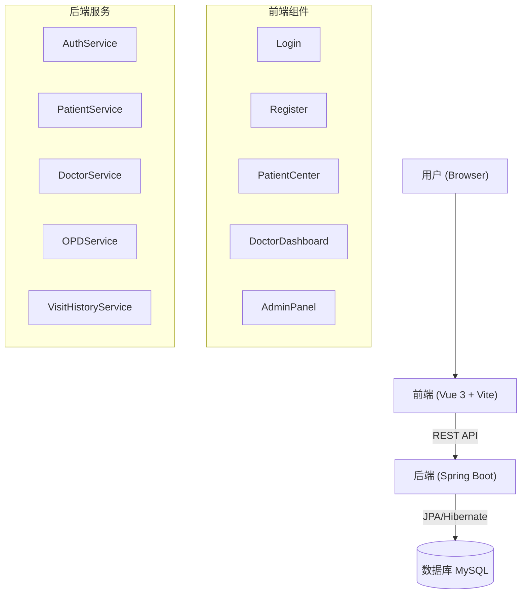
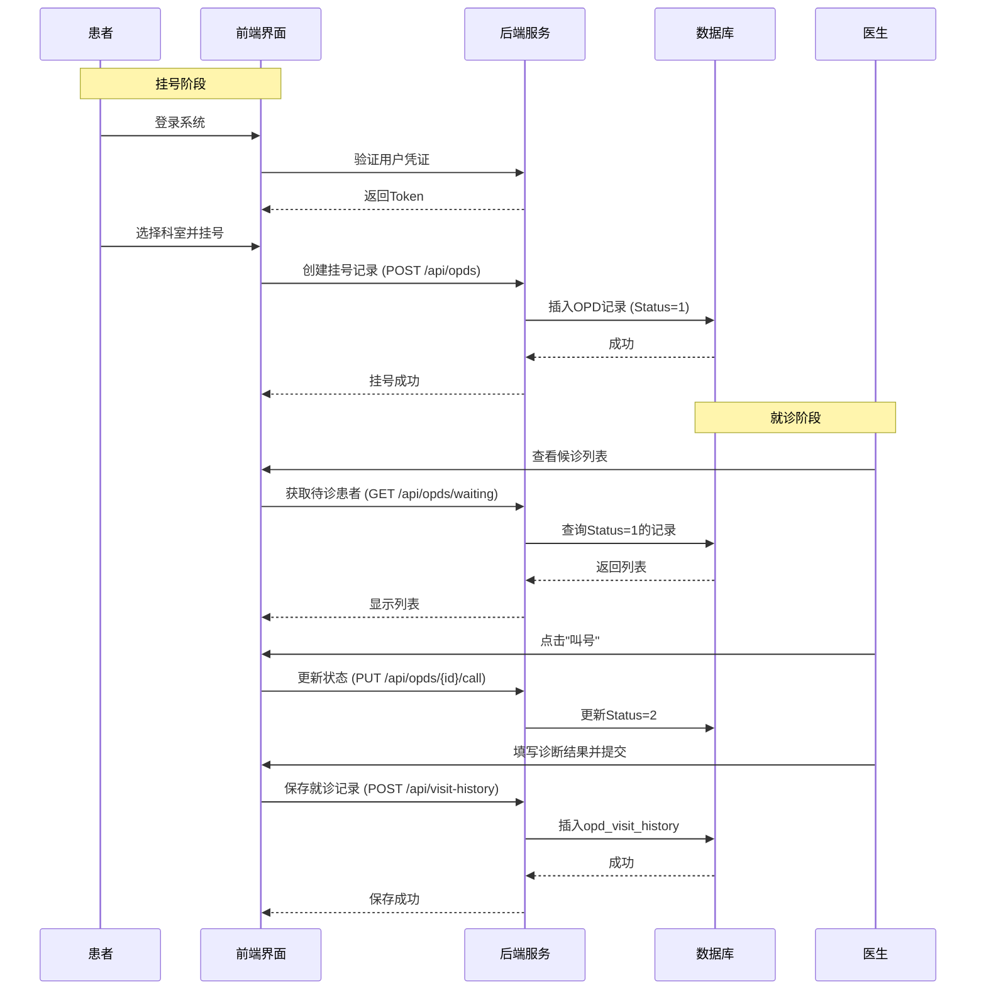
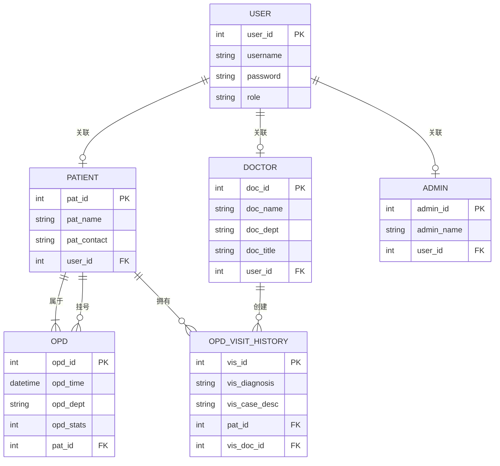

# 系统设计说明书

## 编写人员修订记录

| 变更版本号 | 日期 | 变更类型 | 修改人 | 摘要 | 备注 |
| :--- | :--- | :--- | :--- | :--- | :--- |
| 0.0.1 | 2025.12.15 | A | DAVE | 增加了门诊挂号部分内容 | |
| 1.0.0 | 2025.12.25 | M | AI | 更新文档以匹配当前系统实现 | |

*注：A - 增加  M - 修订  D - 删除*

## 目 录

1. [编写目的](#1-编写目的)
2. [项目概述](#2-项目概述)
3. [系统各个模块功能简述](#3-系统各个模块功能简述)
4. [系统各个模块业务流程图](#4-系统各个模块业务流程图)
5. [系统数据库设计](#5-系统数据库设计)
6. [总结](#6-总结)

## 1 编写目的

本文档明确定义了门诊系统的界面需求和算法设计，是设计人员进行详细设计和测试人员进行系统测试的主要依据。

### 1.1 背景

随着社会的进步，信息技术的不断发展，传统的医院管理模式不再适应现在高速发展的现代化医院，甚至对医院的高速发展还会带来一定阻碍，主要体现在医院过多繁杂的程序上面浪费了大量的时间、人力和物力，虽然医院在管理上面投入不菲，但效果甚微，达不到理想的效果。为此特提出《门诊系统》的调研与开发，以改变现有的门诊流程，提高效率。

### 1.2 读者对象

*   项目管理人员
*   业务需求人员
*   系统分析人员
*   系统设计人员
*   系统开发人员
*   系统测试人员

### 1.3 术语与缩写解释

| 缩写、术语 | 解 释 |
| :--- | :--- |
| PP | 项目规划，Project Planning |
| HIS | 医院信息系统，Hospital Information System |
| OPD | 门诊部，Outpatient Department |

## 2 项目概述

### 2.1 软件系统的目标

系统目前实现了 **患者管理**、**医生管理** 和 **门诊挂号** 模块，作为医院信息管理系统（HIS）的核心基础模块。

系统采用前后端分离架构，支持患者信息的全生命周期管理，方便医护人员快速访问和维护患者数据。主要功能模块包括：
*   **患者管理**：注册、登录、信息查询与修改。
*   **医生管理**：医生信息维护、排班与候诊管理。
*   **门诊挂号**：患者自助挂号、查询挂号记录、医生叫号/过号。
*   **就诊记录**：医生录入诊断结果、病历描述。

### 2.2 软件系统中的角色

| 角色名称 | 工作简述 |
| :--- | :--- |
| **系统管理员 (ADMIN)** | 负责系统的配置、维护、用户管理、医生信息管理等。 |
| **门诊医生 (DOCTOR)** | 负责患者的诊断、查看候诊列表、叫号、填写病历等医疗活动。 |
| **患者 (PATIENT)** | 注册个人信息、挂号、查询就诊记录、支付等。 |

### 2.3 开发平台

*   **开发语言**：Java (JDK 1.8+), JavaScript (ES6+)
*   **后端框架**：Spring Boot 2.7.18, Spring Data JPA, Spring Security
*   **前端框架**：Vue 3, Vite, Vue Router
*   **数据库**：MySQL 8.0
*   **开发工具**：VS Code, IntelliJ IDEA
*   **应用服务器**：Tomcat (Spring Boot Embedded)

### 2.4 系统总体架构

## 3 系统各个模块功能简述

| 模块 | 功能 | 子功能 | 功能简述 |
| :--- | :--- | :--- | :--- |
| **患者管理子系统** | 患者信息管理 | 注册/登录 | 用户注册、登录、JWT认证 |
| | | 个人信息管理 | 查看和修改个人基本信息（姓名、联系方式等） |
| | | 就诊历史查询 | 查询个人的历史就诊记录和诊断结果 |
| **门诊管理子系统** | 门诊挂号管理 | 在线挂号 | 选择科室进行挂号（生成OPD记录） |
| | | 挂号查询 | 查询挂号状态（排队中、就诊中、已完成等） |
| **医生工作站** | 候诊管理 | 候诊列表 | 查看本科室待就诊患者列表 |
| | | 叫号/过号 | 对患者进行叫号或过号操作 |
| | 就诊管理 | 就诊记录录入 | 填写患者主诉、诊断结果、病历描述 |
| | | 历史记录查看 | 查看患者过往病历 |
| **系统管理** | 用户管理 | 用户维护 | 管理员管理医生、患者账户 |
| | | 医生信息管理 | 新增、修改、删除医生信息 |

## 4 系统各个模块业务流程图

### 4.1 门诊挂号与就诊流程

## 5 系统数据库设计

### 5.1 ER图设计

### 5.2 数据库表设计

#### 5.2.1 用户表 (user)
| 字段名 | 类型 | 说明 |
| :--- | :--- | :--- |
| user_id | int | 主键，自增 |
| username | varchar(50) | 用户名，唯一 |
| password | varchar(255) | 加密密码 |
| email | varchar(100) | 邮箱 |
| phone | varchar(20) | 电话 |
| status | char(1) | 状态 (A: Active) |

#### 5.2.2 角色表 (role)
| 字段名 | 类型 | 说明 |
| :--- | :--- | :--- |
| role_id | int | 主键 |
| role_name | varchar(50) | 角色名 (ROLE_ADMIN, ROLE_DOCTOR, ROLE_PATIENT) |

#### 5.2.3 患者表 (patient)
| 字段名 | 类型 | 说明 |
| :--- | :--- | :--- |
| PAT_ID | int | 主键，病历号 |
| PAT_NAME | varchar(50) | 姓名 |
| PAT_AGE | int | 年龄 |
| PAT_SEX | char(1) | 性别 |
| PAT_TEL | varchar(20) | 联系电话 |
| user_id | int | 关联用户ID |

#### 5.2.4 医生表 (doctor)
| 字段名 | 类型 | 说明 |
| :--- | :--- | :--- |
| doc_id | int | 主键 |
| doc_name | varchar(50) | 姓名 |
| doc_dept | varchar(50) | 科室 |
| doc_title | varchar(50) | 职称 |
| user_id | int | 关联用户ID |

#### 5.2.5 门诊挂号表 (opd)
| 字段名 | 类型 | 说明 |
| :--- | :--- | :--- |
| OPD_ID | int | 主键，挂号单号 |
| OPD_DATE | datetime | 挂号日期 |
| OPD_DEPT | varchar(50) | 挂号科室 |
| OPD_PAT_ID | int | 关联患者ID |
| OPD_STATS | int | 状态 (1-挂号成功, 2-叫号, 3-过号) |

#### 5.2.6 就诊记录表 (opd_visit_history)
| 字段名 | 类型 | 说明 |
| :--- | :--- | :--- |
| VIS_ID | int | 主键 |
| PAT_ID | int | 患者ID |
| VIS_DOC_ID | int | 医生ID |
| VIS_CASE_DESC | text | 病例描述 |
| VIS_DIAGNOSIS | varchar(200) | 诊断结果 |
| VIS_CREATED_DATE | datetime | 创建时间 |

## 6	总结
### 6.1	系统未完成的功能
更多的登陆人员角色的模块需要完善

### 6.2	心得与体会
通过这个项目，我不仅掌握了医院信息系统的基本架构和功能模块，还提高了数据库设计和系统分析能力。同时，也认识到在实际项目中，需要充分理解业务需求，才能设计出符合实际应用场景的系统。这个项目为我今后参与更复杂的信息系统开发积累了宝贵经验。
